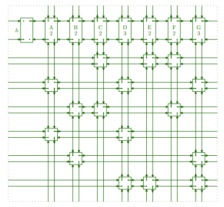

# Rusty Sudoku

A program for solving Sudokus in Rust.

The main motivation for this is to explore how to 
implement [Donald Knuth's Dancing Links Algorithm X](https://en.wikipedia.org/wiki/Dancing_Links) in Rust. 
The algorithm heavily relies on pointer manipulation, which makes it interesting to implement in Rust, as pointers in Rust are considered *'unsafe'*. 

The sample puzzles were generated by [sudoku-puzzles-online.com](https://www.sudoku-puzzles-online.com/), which conveniently allows copying the puzzles as text.

Three different versions of the DLX algorithm were implemented to test the performance difference between *'safe'* Rust implementation based on array indexing vs. using raw pointers. For reference, a brute force Sudoku solver is also included.

## Performance results

The results of running `cargo +nightly bench` are:
````
test brute::tests::bench_brute_9x9                     ... bench:  82,777,840 ns/iter (+/- 12,132,007)
test dancer::tests::bench_indexed_unchecked_dancer_9x9 ... bench:   1,158,060 ns/iter (+/- 231,515)
test dancer::tests::bench_indexed_unchecked_dancer_all ... bench:  72,264,240 ns/iter (+/- 7,099,552)
test dancer::tests::bench_indexed_vec_dancer_9x9       ... bench:   1,158,242 ns/iter (+/- 303,372)
test dancer::tests::bench_indexed_vec_dancer_all       ... bench:  74,235,130 ns/iter (+/- 7,619,936)
test dancer::tests::bench_pointed_dancer_9x9           ... bench:     983,622 ns/iter (+/- 176,249)
test dancer::tests::bench_pointed_dancer_all           ... bench:  54,933,699 ns/iter (+/- 7,057,123)
````

Changing the indices from `usize` to `u16` improved the performance somewhat:

````
test brute::tests::bench_brute_9x9                     ... bench:  81,717,859 ns/iter (+/- 7,617,408)
test dancer::tests::bench_indexed_unchecked_dancer_9x9 ... bench:   1,186,752 ns/iter (+/- 150,205)
test dancer::tests::bench_indexed_unchecked_dancer_all ... bench:  65,731,020 ns/iter (+/- 3,064,714)
test dancer::tests::bench_indexed_vec_dancer_9x9       ... bench:   1,213,523 ns/iter (+/- 213,101)
test dancer::tests::bench_indexed_vec_dancer_all       ... bench:  67,168,960 ns/iter (+/- 3,606,725)
test dancer::tests::bench_pointed_dancer_9x9           ... bench:     993,211 ns/iter (+/- 119,865)
test dancer::tests::bench_pointed_dancer_all           ... bench:  53,790,280 ns/iter (+/- 6,221,967)
````

The `_9x9` benchmarks solve only 9x9 sudokus and `_all` benchmarks solve 9x9 and 16x16 sudokus. The brute force algorithm is too slow to use on 16x16 sudokus. Clearly the DLX approach to solving Sudokus is way faster than naive brute forcing.

Unsurprisingly, the DLX version using raw pointers is significantly faster than the indexed versions. What is surprising is that the main reason for the difference doesn't appear to be due to array bounds checking. The unchecked version is only slightly faster than the checked version using the Rust *std::vec::Vec* container type. Presumably, the pointer arithmetics involved in array access account for most of the performance difference, although it is difficult to be sure.

## Implementation details

### Brute force
The brute force Sudoku solver in [brute.rs](src/brute.rs) systematically tries inserting all possible numbers into free cells until a solution is found.

### Dancing Links X
A game of Sudoku has the following rules:
1. Each number can appear only once in each row,
2. and column,
3. and box.
4. There can only be one number in each cell.

The DLX approach to solving a Sudoku is based on reducing the Sudoku problem to *the exact cover problem*. Each Sudoku move is represented by a binary vector where there are exactly four columns with `1`, corresponding to the constraints set by that move.

If the size of the Sudoku grid is *SxS*, for some move *(i,j,k)* where the number *k* is placed in the grid cell *(i,j)*, the vector corresponding to the move is defined by:
* Element *iS + k* is set to 1, corresponding to rule 1.
* Element *S^2 + jS + k* is set to 1, corresponding to rule 2.
* Element *2S^2 + b(i,j)S + k* is set to 1, corresponding to rule 3, where *b(i,j)* is the box number of the cell *(i,j)*.
* Element *3S^2 + iS + j* is set to 1, corresponding to rule 4.

*Note:* *i, j, k & b(i,j)* range from 0 to S-1, instead of 1 to S of normal sudoku.

Clearly, if two such vectors have a *1* in the same column, then those moves are mutually contradicting, violating at least one of the rules of the game. 

Vectors corresponding to the possible moves to empty cells, as well as the moves corresponding to the given numbers are placed as rows into a matrix *M*. A valid solution is found by finding a subset of the rows of *M* such that there is exactly one *1* in each column.

The matrix *M* is quite sparse. The DLX algorithm exploits this by storing the matrix as a collection of linked nodes for cells containig a *1*.

Each node contains pointers to neighbouring nodes in the four cardinal directions: *up, down, left & right*. The nodes of each row form a circular doubly-linked list via the *left & right* pointers. Similarly, all columns form a circular doubly-linked list using pointers *up & down*.

In addition to the regular nodes, special column header nodes are placed at the top of each column. An extra-special root node is created to the left of all header nodes. The header nodes are used for storing a count of the number of cells in each column.

<br>Image borrowed from [Dancing Links, Donald E. Knuth](https://arxiv.org/pdf/cs/0011047.pdf).

The algorithm is as follows:
1. Pick the column *C* with the least number of cells.
   * If none exist, a solution was found, return.
    * If the column has no *1s*, there is no solution, return.
2. Pick a row *R* that has a *1* in column *C*.
3. Reduce the matrix by removing all rows that clash with *R* by having a *1* in any column where *R* has a *1*. 
4. Recurse from 1.
    * If no solution was found, return.
    * If a solution was found, return with solution.
5. Restore changes done to the matrix in step 3.
6. Repeat from 2, picking another row.
    * If no rows remain, return without solution.

The "trick" in DLX is to reduce the matrix by updating the links in the remaining nodes, without modifying the links in the removed nodes. The matrix can be restored via the links in the removed nodes to reinsert them.

The regular nodes require five pointers: Four for the directions, *left, right, up & down* and one to point to the column header.

Header nodes require four pointers for the directions and an additional field to store the row count.

Knuth's DLX constructs a discovered solution by using a *name* field in the header nodes. Here a more direct approach is used, where the left-most node of each row contains an additional *label* field. These labels contain the *(i,j,k)* triplets corresponding to the Sudoku move.

The input to the DLX algorithms are a list of rows of the form *(label, [<columns>])*, where *label* is the row label and *[<columns>]* is a list of column numbers having *1* on that row. The algorithms have a constructor *new()* for the matrix that builds the initial matrix from this list of rows. The method *solve()* tries to find a solution, returning a list of labels if a solution is found.

#### Indexed DLX

The preferred approach in Rust for representing graphs and graph-like datastructures appears to be to store the nodes in a `Vec` and refer to them using indices. This implementation was partly inspired by [Dancing Links In Rust](https://ferrous-systems.com/blog/dlx-in-rust/).

By allocating the left-most nodes of each row first, their indices correspond to their row number. 
These *label nodes* can be found by checking if their *index < number of rows*. A separate list of labels that is indexed by the row number is kept for constructing the solution. The *column* pointer field of header nodes is repurposed as the row counter, removing the need to store that in a separate list. During the construction of the initial matrix, a list that maps column numbers to header node indices is created, but this is not needed in the *solve()* method.

The *IndexedMatrixSolver<C>* in [indexed.rs](src/dancer/indexed.rs) is parametrized to accept different container types. Two different containers are used, the standard *std::vec::Vec* and the *Unchecked* in [unchecked.rs](src/dancer/indexed/unchecked.rs). The *Unchecked* container does not perform any bounds checks in release builds.

The solver needs containers for three different types. The parametrization of the generic container type is achieved by two traits:
*AbstractContainerType* and *AbstractContainer<T>*.

The *AbstractContainer<T>* has basic operations needed for constructing and using a container. It is implemented for *Vec<T>* and *Unchecked<T>*.

The *AbstractContainerType* has a parametric associated type *Container<T>*. Two types *VecContainerType* and *UncheckedContainerType* implement *AbstractContainerType* by setting *Container<T>* to the appropriate type *Vec<T>* or *Unchecked<T>*.

Passing either *VecContainerType* or *UncheckedContainerType* to *IndexedMatrixSolver* allows the same code to use two different container types.

The type of the indices can also be changed in the code. Using `usize` is a natural choice due to it being the type used for indexing `Vec`s. However, `usize` is 64-bits on a 64-bit system. The 16-bit `u16` makes the nodes smaller and presumably speeds up the execution due to fewer cache misses. Making *IndexedMatrixSolver* parametric over the index type is probably possible, but would either involve a ridiculous amount of code, or the use of external packages that have version numbers that start with 0. 

#### Pointer DLX

The DLX version using pointers *PointedMatrixSolver* is in [pointed.rs](src/dancer/pointed.rs). The code is almost completely inside an *unsafe* block to make pointer manipulation more convenient. 

Each of the three different kinds of nodes have their own types: *LabelNode*, *HeaderNode*, *RegularNode* and all of them have a "*base type*": *BasicNode*. Having separate types ensures that the least possible amount of storage is used for each type. By using the *repr(C)* representation, the fields of the types can be arranged to overlap. This means that pointers of all of the types can be cast into a pointer of *BasicNode*. To make this easier, they are placed in a union called *Node* and all pointers are pointers to *Node*. 

The type *NodeArray* is used to allocate an array of nodes of a given type. The memory allocated is deliberately left uninitialized in the interest of "performance". This resulted in some interesting errors to debug early in the project.

Each *NodeArray* can tell if a pointer lies within its allocated memory block. This is used to identify the *LabelNode* when constructing the solution. 


## Issues and remarks

### Nested indirection in indexing

The DLX algorithm involves multiple instances where a pointer is updated via another pointer. In C, it would look something like this:
````c
node->right->left = node->left;
````

Rust does not have the *->* operator and pointers are dereferenced using *. This means that the above code in Rust looks like this:
````Rust
(*(*node).right).left = (*node).left;
````

But that isn't half as bad as what happens with indexing:
````Rust
nodes[nodes[i].right].left=nodes[i].left; // <- This does not compile!

let temp=&mut nodes; // This does!
temp[temp[i].right].left=temp[i].left;
````
The first example does not compile due to the borrowing rules in Rust. The outer `nodes[...]` translates to `nodes.index_mut(...)`, which requires a `&mut` reference to `nodes`, while the nested `nodes[...]` requires a `&` reference. Although the `&mut` reference isn't needed until the `index_mut` method is actually called and the inner expression evaluates to `usize`, Rust is unable to compute due to `&` being used in the inner expression. This leads to the code being littered with awkward temporary variables. 

### Indexing using usize

Containers, such as `Vec`, in Rust are indexed using `usize`. Unfortunately, a better fit for storing the indices is `u16`. Since Rust does not do automatic numeric type widening, type conversion must be done each time a `u16` is used for indexing. This combined with the previous issue results in code that looks like this:

````rust
let ccr = self.cells[c.into()].right;
self.cells[ccr.into()].left = self.cells[c.into()].left;
let ccl = self.cells[c.into()].left;
self.cells[ccl.into()].right = self.cells[c.into()].right;
````

Having to compare a `u16` to a `usize` required `usize::from(x16) < xsize`, because `x16.into() < xsize` produces an error for some reason.

### Implementing Copy

While probably not strictly necessary, each node type in [pointed.rs](src/dancer/pointed.rs) implements *Copy*. This causes a problem due to *LabelNode* having a reference to the generic *Label* type that doesn't require *Copy*. While references are *Copy*, the derive macro for *Copy* isn't smart enough to understand that and refuses to implement *Copy* for *LabelNode*. Since *LabelNode* is contained in *Node* and all node types have pointers to *Node*, none of the node types can have *Copy* implemented using `#[derive(Copy)]`. Fortunately, it is not too difficult to write a macro that implements *Copy* & *Clone* for all of the node types.

### Lack of shared mutable references

Rust famously does not allow having multiple mutable references at the same time. If there were safe, mutable shared references, the DLX algorithm could be implemented in *safe* Rust using them, having performance identical to the implementation using pointers.

[The Rustonomicon](https://doc.rust-lang.org/nomicon/aliasing.html) states that the reason for disallowing shared mutable references is the desire to enable certain compiler optimization, which are only possible if the compiler can be certain that mutable pointers are not aliased. If this were the only reason, it would be easy to just make the compiler treat select references as potentially being aliased. However, there are other problems with shared mutable references. 

Some types in Rust have varying internal structure. If there are any references to the innards of an object of such type, the object must not be mutated in such a way as to cause the object's structure to change. For example (borrowed from [here](https://manishearth.github.io/blog/2015/05/17/the-problem-with-shared-mutability/)):

````rust
enum StringOrInt {
    Str(String),
    Int(i64)
}

let x = Str("Hi!".to_string());
let y = &mut x;

if let Str(ref innards) = x { 
    *y = Int(1); 
    println!("x says: {}", innards); // What happens here?
}
````

The above example does not compile, but if a raw pointer is used for `y`, the program will segfault. The issue with the example is that the `if let` is committed to `x` being `Str(_)`, taking a reference to the innards, but the structure of `x` is modified so that the reference `innards` becomes invalid. This cannot be fixed by simply telling the compiler that references might be aliased. Once the execution hits `*y=Int(1)`, the previous pattern match becomes invalid and the execution shouldn't be inside the then-block, causing a contradiction that the compiler cannot resolve.

On the other hand, it is clear that shared mutability is not always unsafe and can be quite useful.

Rust could probably have shared mutable references, if there was a way to indicate that references are potentially aliased and the borrow checker were modified to support shared mutability. This could be done by either having a marker trait on types that allow shared mutable references, or having a special, shared mutable reference type that isn't allowed to coexist with the regular references. Either way, the borrowing rules would have to be modified to detect the cases where shared mutability is not acceptable.

The shareable mutable reference shoud be `!Sync` to disallow sharing across threads.
